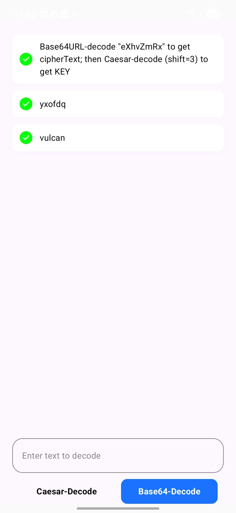

# Vulcan Labs Test

## Table of Contents
- [Project Overview](#project-overview)
- [Additional Questions](#additional-questions)
  - [A. Android Knowledge](#a-android-knowledge)
  - [B. Android Practical Experience](#b-android-practical-experience)

---

## Project Overview

This repository contains the technical test submission for Vulcan Labs internship position.



**How to Run:**
```cmd
./gradlew installDebug
```

---

## Additional Questions

### A. Android Knowledge

#### 1. Data Loss During Activity Recreation

**Question:** What data is most likely to be lost when an Activity is destroyed and recreated?

**Answer:**

The following data types are vulnerable to loss during Activity recreation:

- **Compose State:** State created with `remember { mutableStateOf() }` pattern
- **UI States:** Including `ScrollState`, `LazyListState`, and `TextField` state
- **Activity Fields:** Non-preserved instance variables

**Solution:**

To prevent data loss, I implement the following approach:
- Expose UI state from a `StateFlow` in the ViewModel
- Leverage `SavedStateHandle` for state persistence across process death
- Follow proper state hoisting and state management patterns

---

#### 2. Why Heavy Operations Should Not Run on Main Thread

**Question:** Why must heavy operations avoid the main thread?

**Answer:**

 Heavy operations must not run on the main thread because, by design, the main thread is responsible for handling user interactions, rendering the UI, and displaying animations. If tasks such as API calls or file I/O are executed on it, the application may freeze or lag, since the main thread has to wait for those operations to complete before it can continue rendering the UI.

**Consequences of blocking the main thread:**
- Application freezes or becomes unresponsive (ANR - Application Not Responding)
- Poor user experience with laggy interface
- The UI cannot update until the operation completes


### B. Android Practical Experience

#### 1. Debugging Approach for Crashes

**Question:** How would you debug a crash reported by a user?

**Answer:**

My systematic debugging approach:

1. **Collect Information**
   - Gather error description, logs, and stack trace
   - Implement a "Report Issue" feature for users to send diagnostic data
   - Utilize crash reporting tools (Firebase Crashlytics, Sentry)

2. **Reproduce the Issue**
   - Recreate the crash based on user's description
   - Test on similar device/OS version if hardware-specific

3. **Identify the Root Cause**
   - Analyze which class, method, and line number triggered the error
   - Determine which thread the crash occurred on
   - Review business logic and state handling in suspicious areas

4. **Debug and Fix**
   - Place strategic breakpoints at failure points and suspected areas
   - Step through code execution to pinpoint the exact source
   - Implement fix and add defensive programming checks

5. **Verify and Test**
   - Test the fix under various scenarios
   - Perform regression testing to ensure no new issues

---

#### 3. At which step did you face confusion or errors

**Question:** At which step did you face confusion or errors?

**Answer:**

I encountered difficulties understanding how to decode base64 to retrieve the instructions. This requires:
- Understanding Base64 encoding/decoding concepts
- Implementing proper error handling for invalid formats
- Testing edge cases (empty strings, invalid characters)

---

#### 4. How did you debug and verify your solution to get the correct result?

**Question:** How did you debug and verify your solution to get the correct result?

**Answer:**

**Testing Strategy:**

1. **Happy Path Testing**
   - Ran the application under ideal conditions
   - Verified expected behavior with valid input

2. **Error Scenario Testing**
   - **Empty Input:** Tested application behavior with no input
   - **Invalid Base64 Format:** Verified error handling for malformed data
   - Ensured graceful degradation

3. **Issue Documentation**
   - Documented all discovered issues
   - Categorized by severity and impact

4. **Fix and Verification**
   - Implemented fixes for identified issues
   - Re-ran test suite to verify corrections
   - Performed regression testing

**Test Cases Covered:**
- Valid Base64 input
- Empty string input
- Invalid Base64 characters
- Null input handling
- Edge cases (whitespace, special characters)
